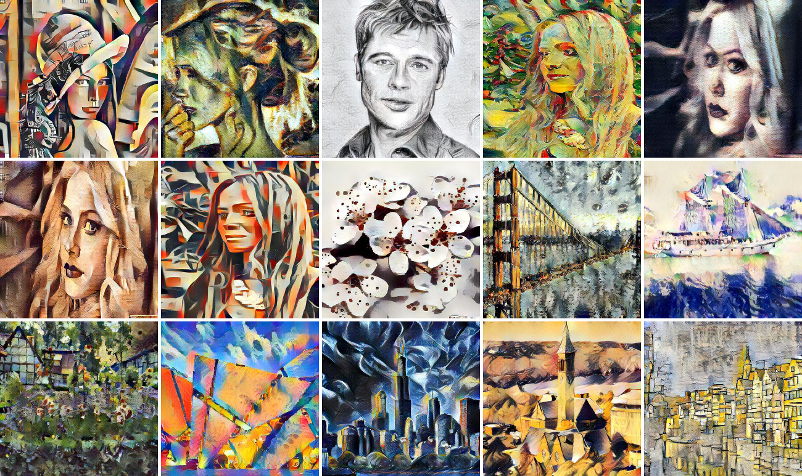

## Demo
[CVPR 2019 Version Demo Site](http://style.airi.kr/ori_demo) 
[Improved Version Demo Site](http://style.airi.kr/demo)

## Sample Images

## Abstract
Arbitrary style transfer aims to synthesize a content image with the style of an image to create a third image that has never been seen before. Recent arbitrary style transfer algorithms find it challenging to balance the content structure and the style patterns. Moreover, simultaneously maintaining the global and local style patterns is difficult due to the patch-based mechanism. In this paper, we introduce a novel style-attentional network (SANet) that efficiently and flexibly integrates the local style patterns according to the semantic spatial distribution of the content image. A new identity loss function and multi-level feature embeddings enable our SANet and decoder to preserve the content structure as much as possible while enriching the style patterns. Experimental results demonstrate that our algorithm synthesizes stylized images in real-time that are higher in quality than those produced by the state-of-the-art algorithms.

## Paper
[Arbitrary Style Transfer with Style-Attentional Networks Paper](https://arxiv.org/abs/1812.02342)

## Modify 
page4  
3.3 full system  
The weighting parameters are simply set as λc= 1,λs= 3, λidentity1=1, and λidentity2=50 in our experiments.  
-> The weighting parameters are simply set as λc= 1,λs= 3, λidentity1=50, and λidentity2=1 in our experiments.

## Implementation
There is no plan to open source code. 
But you can reproduce results using these resources or implemetation from GlebBrykin
<ol>
  <li>Paper</li>
  <ul>
    <li><a href="https://arxiv.org/abs/1812.02342">https://arxiv.org/abs/1812.02342</a></li>
  </ul>
  <li>Adain Implement</li>
  <ul>
    <li><a href="https://github.com/naoto0804/pytorch-AdaIN">https://github.com/naoto0804/pytorch-AdaIN</a></li>
  </ul>
  <li>non local block self attn class</li>
  <ul>
    <li><a href="https://github.com/heykeetae/Self-Attention-GAN/blob/master/sagan_models.py">https://github.com/heykeetae/Self-Attention-GAN/blob/master/sagan_models.py</a></li>
  </ul>
  <li>implement from GlebBrykin</li>
  <ul>
    <li><a href="https://github.com/GlebBrykin/SANET">https://github.com/GlebBrykin/SANET</a></li>
  </ul>
</ol>

## Contact
[Dae Young Park](mailto:likebullet86@gmail.com)  
[Kwang Hee Lee](mailto:lkwanghee@gmail.com)  
[github](https://github.com/dypark86/SANET)
